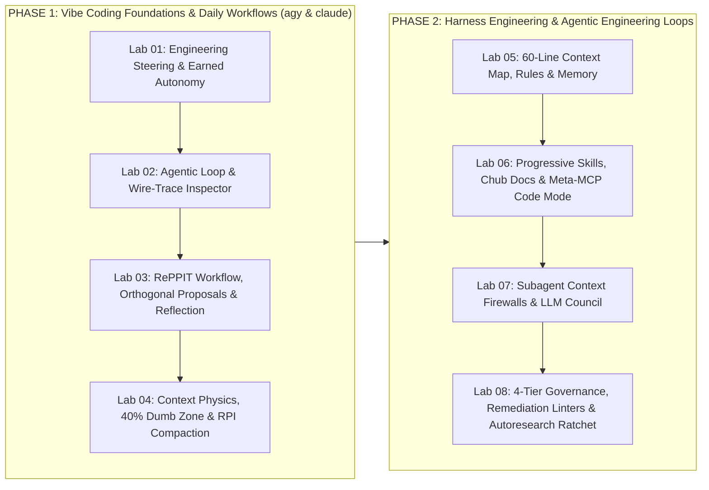

# Vibe Coding & Agentic Harness Engineering (`Vibe-Coding-Course`)

> **You are on the `claude` branch** — it ships only the Claude Code harness (`CLAUDE.md`, `.claude/`, `.claude-plugin/`, `playbooks/CLAUDE_CODE_PLAYBOOK.md`, `tests/claude_track/`). Switch to `agy` for the Antigravity / Gemini CLI harness, or `main` for both side by side.

> **A Two-Phase Hands-On University & Practitioner Course: From Vibe Coding Foundations (`agy` & `claude`) to Harness Engineering & Autonomous Agentic Loops**
> **Author:** Alejandro Kaspar - AI Forward Deployed Engineer
> **Dual-Branch Support:** `agy` (Google Antigravity / Gemini CLI) & `claude` (Anthropic Claude Code)

[](LICENSE)
[](NOTICE)
[](self_diagnose_all.sh)
[](labs/)

Welcome to **Vibe-Coding-Course**—a comprehensive, self-diagnosing **Two-Phase Technical Course** designed for software engineers, AI engineers, and technical leads mastering **Google Antigravity (`agy`)** and **Anthropic Claude Code (`claude`)**:

- **Phase 1 — Vibe Coding Foundations & Daily Workflows (Modules 1–4 & Labs 01–04):** Understand *why* natural language coordinates executable code (bridging Wittgenstein's shift from formal Picture Theory to Language-as-Action, Unmesh Joshi & Martin Fowler's *What Is Code?*, and Andrew Ng's *AI Engineering Skills Map*), trace the **2022–2026 Architectural Evolution & 17-Day Flagship Release Cadence** (143 notable releases and 57 flagships across 8 major lab groups, with the industry flagship interval compressing from 37 days in 2023 to 17 days in 2026), inspect coding agents on the wire (Stanford CS146S Wireshark traces & "Swiss Army Knife" primitives), direct the **`RePPIT` (`Research -> Propose -> Plan -> Implement -> Verify`)** daily workflow with **Post-Proposal Context Reset**, and master **Context Window Physics** (`Smart Zone <= 40%` vs. `Dumb Zone > 40%`, `karpathy/autoresearch` output-redirection backpressure, and **Frequent Intentional Compaction [`RPI`]**).
- **Phase 2 — Harness Engineering & Agentic Engineering Loops (Modules 5–8 & Labs 05–08):** Architect the 4 layers of a production Agent Harness ($\text{Agent} = \text{Model} + \text{Harness}$): **Layer 1** (`CLAUDE.md` / `GEMINI.md` 60-line maps, the 150-Instruction Compliance Cliff, and provenance-tagged Auto-Memory), **Layer 2** (`agentskills.io` 3-Level Progressive Disclosure, `andrewyng/context-hub` [`@aisuite/chub`] self-annotating docs, Stanford CS146S **Meta-MCP "Code Mode"** with $\ge 90\%$ token reduction, and `SkillsBench`), **Layer 3** (**Subagents as Context Firewalls**, Multi-Agent PR Triage, Karpathy's `llm-council` anonymized Borda peer review, and **Parallel Workspace Isolation via `git worktree` vs. Colocated Jujutsu `jj` Workspaces** — working-copy `@` auto-snapshots, stable Change IDs, First-Class Conflict Algebra where rebases never fail mid-loop, and transactional `jj op log` / `jj undo`), and **Layer 4** (`andrewyng/openworker` 4-Tier Governance & `PreToolUse` Exit-Code-2 hooks, **Databricks `Omnigent` Meta-Harness** [`omnigent.ai` — multi-harness YAML composition, stateful session-taint & \$100 cost-cap policies, egress-proxy credential injection, and live URL session sharing], OpenAI Remediation-Aware Structural Linters, **Durable Execution Frameworks (`Temporal`, `LangGraph`, `DBOS`, `Restate`, `Inngest`)** for 12–16 hr+ crash-recoverable loops, Dex Horthy's Front-Loaded Program Design, and Karpathy's **`autoresearch` & `program.md` Simplicity Criterion & Keep-or-Revert Ratchet**).

---

## 1. Quickstart (`< 1s` Self-Diagnosis Across All 8 Labs)

```bash
# Clone and switch to your preferred harness branch ('agy' or 'claude', or stay on 'main' for both)
git checkout agy     # For Google Antigravity / Gemini CLI track
git checkout claude  # For Anthropic Claude Code track

# Run the master self-diagnosis suite across all 8 labs (< 1 second, zero external deps)
./self_diagnose_all.sh

# Run the track verification suite for both 'agy' and 'claude' harnesses
CI=true python3 -m unittest discover -s tests -p "test_*.py" -v
```

---

## 2. Two-Phase Course Architecture



---

## 3. Progressive 8-Lab Hands-On Curriculum

| Lab | Phase & Core Engineering Topics | Deliverable (`expected_output/` / `work/`) | Verified Requirements |
| :--- | :--- | :--- | :--- |
| **[Lab 01](labs/lab_01_vibe_coding_and_earned_autonomy/WALKTHROUGH.md)** | **Phase 1 — Vibe Coding vs. Software-Engineering Steering & Earned Autonomy**<br>Ubiquitous Language (`AccountId`, `MoneyCents`), Andrew Ng's *AI Skills Map* Pillar 02 prompt steering, `agy`/`claude` permission modes, `openworker` Hard Floors, Reviewer Circuit Breaker, and Provenance Audit Trail | `prompt_steerer.py` | `REQ-0101` .. `REQ-0106` |
| **[Lab 02](labs/lab_02_agent_loop_and_harness_wire_trace/WALKTHROUGH.md)** | **Phase 1 — The Core Agentic Loop & Wireshark-Style Harness Wire-Trace Inspector**<br>`aisuite` 3-Layer Stack, `Gather Context -> Take Action -> Verify Results` loop audit, CS146S wire-trace token profiler, "Swiss Army Knife" primitive consolidation vs. 150-tool CRUD bloat, and runaway loop circuit breaker | `wire_trace_inspector.py` | `REQ-0201` .. `REQ-0206` |
| **[Lab 03](labs/lab_03_reppit_workflow_and_reflection/WALKTHROUGH.md)** | **Phase 1 — Directing the Daily Workflow (`RePPIT`) & Reflection**<br>Task Complexity vs. Workflow Rigor spectrum, Socratic `/grill-me` gate, **2 Orthogonal Proposals + Post-Proposal Context Reset**, `Out of Scope / Do NOT Touch` plan guardrails, Phase-Based Model Routing, and `translation-agent` reflection | `reppit_orchestrator.py` | `REQ-0301` .. `REQ-0306` |
| **[Lab 04](labs/lab_04_context_physics_and_rpi_compaction/WALKTHROUGH.md)** | **Phase 1 — Context Window Physics, The 40% "Dumb Zone" & `RPI` Compaction**<br>Dex Horthy's `Smart Zone (<=40%)` vs. `Dumb Zone (>40%)`, `karpathy/autoresearch` output redirection (`> run.log 2>&1`), `/btw` sandboxed side-queries, `rendergit` CXML packing, Frequent Intentional Compaction (`RPI`), and the Human Leverage Pyramid | `context_compactor.py` | `REQ-0401` .. `REQ-0406` |
| **[Lab 05](labs/lab_05_context_primitives_and_memory/WALKTHROUGH.md)** | **Phase 2 (Layer 1) — Context Primitives, 60-Line Root Map & Persistent Memory**<br>Prompts vs. Rules vs. Skills, the 150-Instruction Compliance Cliff, Minimalist 60-Line `CLAUDE.md`/`GEMINI.md` Map with `@docs/*.md` lazy imports, path-scoped rules, and `MEMORY.md`/`KNOWLEDGE.md` provenance (`#direct` vs. `#commit`) | `context_compiler.py` | `REQ-0501` .. `REQ-0506` |
| **[Lab 06](labs/lab_06_skills_chub_and_meta_mcp_code_mode/WALKTHROUGH.md)** | **Phase 2 (Layer 2) — Progressive Skills, `chub` Self-Annotating Docs & Meta-MCP "Code Mode"**<br>`agentskills.io` 3-Level Progressive Disclosure, `andrewyng/context-hub` (`@aisuite/chub`) versioned docs + `chub annotate`, CS146S Ergonomic Tool Rules, **Meta-MCP `search` + `execute` Code Mode ($\ge 90\%$ token savings)**, and `SkillsBench` ablation | `skill_and_mcp_harness.py` | `REQ-0601` .. `REQ-0606` |
| **[Lab 07](labs/lab_07_subagent_firewalls_and_peer_council/WALKTHROUGH.md)** | **Phase 2 (Layer 3) — Subagents as Context Firewalls, PR Triage, `llm-council` & Worktrees/`jj`**<br>Subagent Context Firewalls ($\ge 90\%$ parent token isolation), read-only `feature-dev` subagents, CS146S Multi-Agent PR Triage (`MUST_FIX` / `RECOMMENDED` / `CONSIDER` at $\ge 80$ confidence), Karpathy's `llm-council` anonymized Borda peer review, and disjoint `git worktree` / `jj workspace` ownership | `subagent_council.py` | `REQ-0701` .. `REQ-0706` |
| **[Lab 08](labs/lab_08_governance_linters_and_autoresearch_ratchet/WALKTHROUGH.md)** | **Phase 2 (Layer 4) — 4-Tier Governance, Remediation Linters & The `Autoresearch` Ratchet**<br>2x2 Cybernetic Matrix, `PreToolUse` Exit-Code-2 hard-floor gate, OpenAI `[VIOLATION] -> [WHY] -> [HOW TO FIX]` structural linter, Front-Loaded Program Design (`Ib5GBkD555M`), and Karpathy's `autoresearch` Simplicity Criterion & Git Keep-or-Revert Ratchet | `autoresearch_harness.py` | `REQ-0801` .. `REQ-0806` |

---

## 4. Dual-Branch Harness Architecture (`agy` vs. `claude`)

| Layer | `claude` Branch (Claude Code) | `agy` Branch (Google Antigravity / Gemini CLI) |
| :--- | :--- | :--- |
| **1. Standing Context Map** | [`CLAUDE.md`](CLAUDE.md) ($\le 45$ lines) with `@docs/*.md` lazy imports + `.claude/rules/*.md` | [`GEMINI.md`](GEMINI.md) & [`AGENTS.md`](AGENTS.md) ($\le 45$ lines) with `@docs/*.md` lazy imports + `.agents/rules/*.md` |
| **2. Cross-Session Memory** | `~/.claude/projects/<project>/memory/MEMORY.md` (worktree-shared, 200-line cap) + `/memory` | `~/.gemini/antigravity/knowledge/<project>/KNOWLEDGE.md` (`#direct`, `#commit`, `#time`, `#session`) + `/memory` |
| **3. Workflow & Context Commands** | `Shift+Tab` (`plan mode`), `/context`, `/btw`, `/compact`, `/clear`, `/rewind` | `/plan`, `/grill-me`, `/artifact`, `/browser`, `/stats`, `/compress`, `/clear`, `/goal`, `/schedule` |
| **4. Progressive-Disclosure Skills** | `.claude/skills/{context-hub-docs,reppit-workflow,architecture-guard,harness-audit}/` | `.agents/skills/{context-hub-docs,reppit-workflow,architecture-guard,harness-audit}/` + `/skills` |
| **5. Subagent Firewalls** | `.claude/agents/{code-explorer,code-architect,code-reviewer}.md` + `/feature-dev` | `.agents/agents/{code-explorer,code-architect,code-reviewer}.md` + `.agents/workflows/feature-dev.md` |
| **6. Versioned Plugins & Hooks** | `.claude-plugin/plugin.json` + `.claude/settings.json` + `.claude/learner.settings.json` | `.agents/plugins/vibe-engineering-kit/{plugin.json,mcp_config.json,hooks.json}` |

> **Branch maintenance:** `main` is the dual-harness source of truth. The `agy` and `claude` branches are derived from `main` via `python3 tools/specialize_branch.py agy|claude`.

---

## 5. Primary Sources, Open-Source Reference Architectures & Literature

1. **Andrew Ng & DeepLearning.AI (2026)**: [*The AI Engineering Skills Map*](https://www.deeplearning.ai/resources/ai-engineering-skills#map), [`andrewyng/aisuite`](https://github.com/andrewyng/aisuite), [`andrewyng/openworker`](https://github.com/andrewyng/openworker) (4-Tier Governed Harness), [`andrewyng/context-hub`](https://github.com/andrewyng/context-hub) (`@aisuite/chub`), and [`andrewyng/translation-agent`](https://github.com/andrewyng/translation-agent) (Reflection workflow).
2. **Stanford University CS146S — *The Modern Software Developer* (Mihail Eric, [`themodernsoftware.dev`](https://www.themodernsoftware.dev/), Fall 2025 & Fall 2026)**: Wireshark-style harness trace inspection, "Swiss Army Knife" tool consolidation, the 5-step `RePPIT` workflow with Orthogonal Proposals & Post-Proposal Context Reset, and Meta-MCP "Code Mode" (`>90%` token savings).
3. **Andrej Karpathy (2025–2026)**: *Vibe Coding* (Feb 2025), *MenuGen*, *Software 3.0*, [`karpathy/autoresearch`](https://github.com/karpathy/autoresearch) (`prepare.py`, `train.py`, `program.md`, output-redirection backpressure, Simplicity Criterion, Keep-or-Revert Ratchet), [`karpathy/llm-council`](https://github.com/karpathy/llm-council) (anonymized peer review), and [`karpathy/rendergit`](https://github.com/karpathy/rendergit).
4. **Dex Horthy (HumanLayer, AI Engineer Talks)**: [*No Vibes Allowed: Solving Hard Problems in Complex Codebases*](https://www.youtube.com/watch?v=rmvDxxNubIg) (40% Dumb Zone, Frequent Intentional Compaction, Subagents as Context Firewalls, Human Leverage Pyramid) and [*Harness Engineering is not Enough: Why Software Factories Fail*](https://www.youtube.com/watch?v=Ib5GBkD555M) (RLVR Reward Horizon Gap & 4-Phase Front-Loaded Program Design).
5. **The Anthropic Institute (Jack Clark & Marina Favaro, 2026) & SearchIntel Research (Paul Byrne, 2026)**: [*When AI builds itself: Our progress toward recursive self-improvement*](https://www.anthropic.com/institute/recursive-self-improvement), [*Claude Code 101*](https://academy.claude.com/courses/claude-code-101), and [*The model behind the answer now changes every 17 days*](https://www.searchintel.tech/research/ai-model-release-pace/) (143 notable AI model releases and 57 flagships across 8 major lab groups from Nov 2022 to Sept 2026; industry flagship interval compressing from 37 days in 2023 to 17 days in 2026).
6. **Google Antigravity Official Codelabs**: [*Getting Started with Google Antigravity*](https://codelabs.developers.google.com/getting-started-google-antigravity#0), [*Hands-on with Antigravity CLI*](https://codelabs.developers.google.com/antigravity-cli-hands-on), and [*Build and Deploy to Google Cloud with Antigravity*](https://codelabs.developers.google.com/build-and-deploy-gcp-with-antigravity).
7. **Harness, Meta-Harness, Agentic VCS (`git worktree` vs. Jujutsu `jj`) & Empirical Skill Science**: **Matei Zaharia, Kasey Uhlenhuth & Corey Zumar (Databricks)** ([*Introducing Omnigent: A Meta-Harness to Combine, Control and Share Your Agents*](https://www.databricks.com/blog/introducing-omnigent-meta-harness-combine-control-and-share-your-agents), `omnigent.ai`), **Kevin Riedl (Wavect)** ([*Git Worktrees vs Jujutsu for AI Coding Agents: 2026 Decision Guide*](https://wavect.io/blog/git-worktrees-vs-jujutsu-ai-coding-agents/)) & **Jujutsu VCS** ([`github.com/jj-vcs/jj`](https://github.com/jj-vcs/jj), [`docs.jj-vcs.dev`](https://docs.jj-vcs.dev/)), **Birgitta Böckeler & Kief Morris** (`martinfowler.com`), **Unmesh Joshi & Martin Fowler** ([*What Is Code?*](https://martinfowler.com/articles/what-is-code.html)), **OpenAI** (*Harness Engineering*), **Li et al. (`SkillsBench`)** ([`arXiv:2602.12670`](https://arxiv.org/abs/2602.12670)), and the **Agent Skills Specification** ([`agentskills.io`](https://agentskills.io/specification)).

---

## 6. Course Deliverables & License

- **Student Textbook & Reference Manual PDF**: [`Student_Reference_Manual_Vibe_Coding_to_Agentic_Engineering.pdf`](Student_Reference_Manual_Vibe_Coding_to_Agentic_Engineering.pdf) (also mirrored at [`Coursebook_Vibe_Coding_to_Agentic_Engineering.pdf`](Coursebook_Vibe_Coding_to_Agentic_Engineering.pdf))
- **Lecturer & Professor Instructor Manual PDF**: [`Lecturer_Manual_Vibe_Coding_to_Agentic_Engineering.pdf`](Lecturer_Manual_Vibe_Coding_to_Agentic_Engineering.pdf)
- **Interactive *Learn About* Visual Study Companion (HTML5)**: [`docs/interactive_visual_guide.html`](docs/interactive_visual_guide.html) (clickable `①`–`⑤` hotspots, hoverover tooltips, *Common Misconception* cards, and *Stop & Think* reflections)
- **Interactive Widescreen Slide Deck (HTML5 + Live Simulators)**: [`slides/interactive_slides.html`](slides/interactive_slides.html) (42 interactive slides, 355 hoverover tooltips, 8 live simulators, inline editing, and speaker notes drawer)
- **Widescreen Lecture Slides (PDF) & Tripartite Speaker Notes**: [`slides/Vibe_Coding_Course_Slides.pdf`](slides/Vibe_Coding_Course_Slides.pdf) and [`slides/SPEAKER_NOTES.md`](slides/SPEAKER_NOTES.md)
- **Narrated `1080p` Lecture Videos**: Regenerate or inspect via [`slides/build_video.py`](slides/build_video.py)
- **Playbooks**: [`playbooks/DUAL_HARNESS_VIBE_CODING_PLAYBOOK.md`](playbooks/DUAL_HARNESS_VIBE_CODING_PLAYBOOK.md), [`playbooks/ANTIGRAVITY_PLAYBOOK.md`](playbooks/ANTIGRAVITY_PLAYBOOK.md), and [`playbooks/CLAUDE_CODE_PLAYBOOK.md`](playbooks/CLAUDE_CODE_PLAYBOOK.md)
- **License & Attribution**: Dual-licensed under **Apache License 2.0** (code, scripts, and tests; see [`LICENSE`](LICENSE)) and **Creative Commons Attribution 4.0 International (CC BY 4.0)** (coursebook, lecturer manual, slides, and documentation; see [`NOTICE`](NOTICE) and [`CITATION.cff`](CITATION.cff)). **Author: Alejandro Kaspar - AI Forward Deployed Engineer**.
- **Next Course in the Series**: After completing this Two-Phase course, continue to `SDD-Crash-Course` (Spec-Driven Development) for multi-service distributed system specifications.
