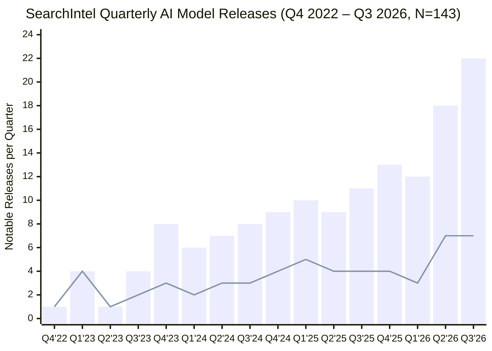
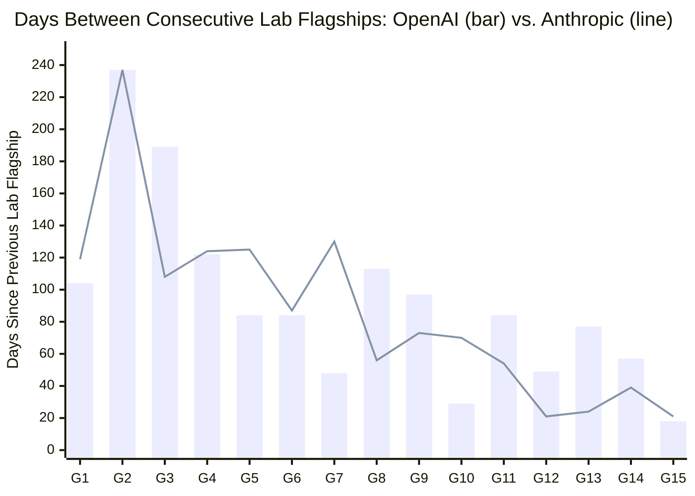

# Language, Code & Software-Engineering Steering (`@docs/language-and-code-foundations.md`)

Referenced on demand from `CLAUDE.md`, `GEMINI.md`, and `AGENTS.md` for Module 1.1 conceptual foundations.

## 1. Why Natural Language Coordinates Code & Action
- **Wittgenstein's Two Theories of Language**:
  - **Early Wittgenstein (*Tractatus Logico-Philosophicus*, 1921) — Picture Theory**: Language as a strict, formal, 1-to-1 logical picture of facts—mirroring how compilers, static type systems, and deterministic unit tests evaluate formal source code.
  - **Late Wittgenstein (*Philosophical Investigations*, 1953) — Language as Tool & Action**: Natural language as a shared toolbox used between collaborators (the Builder and Assistant in `§2`) to coordinate actions within agreed rules (`Molino & Tagliabue, arXiv:2302.01570`; `Winograd & Flores, 1986`; `Wang, Liang, & Manning, ACL 2016, arXiv:1606.02447`).
- **Code as an Externalized Conceptual Model (Unmesh Joshi & Martin Fowler, *What Is Code?*, 2026)**:
  - Source code simultaneously instructs the machine and externalizes the team's **Ubiquitous Language**. Unchecked vibe coding accumulates **Cognitive Debt** when synonyms (`client_id`, `cust_acct`, `tx_amt`) and ungrounded assumptions proliferate across modules.

## 2. Andrew Ng's *AI Engineering Skills Map* (DeepLearning.AI, 2026)
- Synthesized from **>10,000 job postings** across 4 Pillars: (1) *Building & Deploying AI Applications*, (2) *Software Engineering Fundamentals*, (3) *Using Coding Agents*, and (4) *Shaping the Build*.
- **Why Pillar 02 (Software Engineering Fundamentals) Anchors Vibe Coding**: Without software engineering fundamentals, a developer cannot steer a coding agent across latency (`p99`), consistency (`STRONG` vs. idempotent eventual), reliability (retries, circuit breakers), security (input validation, least privilege), and maintainability (typed boundaries).

## 3. The 2022–2026 Model Release Acceleration (17-Day Flagship Cadence) & Model-Agnostic Harnesses
- **Empirical Release-Pace Dataset (Paul Byrne, [*The model behind the answer now changes every 17 days*](https://www.searchintel.tech/research/ai-model-release-pace/), SearchIntel Research, Sept 23, 2026)**:
  - Tracked **143 notable AI model releases** (**57 flagship frontier releases**) across **8 major lab groups** (`OpenAI`, `Anthropic`, `Google`, `Meta`, `xAI`, `DeepSeek`, `Alibaba Qwen / Moonshot Kimi / Z.ai GLM / MiniMax / Xiaomi`, and `Mistral`) from Nov 30, 2022 (`ChatGPT`) through Sept 23, 2026.
  - **Industry-Wide Flagship Interval Compression (`37 days -> 17 days`, $>2.1\times$ acceleration)**: Mean days between consecutive industry flagship releases dropped from **37 days in 2023** (`7` Jan–Sept flagships) $\to$ `8` in 2024 $\to$ `12` in 2025 $\to$ **17 days in 2026** (**`17` flagships** in Jan 1 – Sept 23, 2026), peaking at **22 notable releases (`7` flagships) in Q3 2026** (up $5.5\times$ from `4` releases/quarter in early 2023).
  - **Per-Lab Flagship Compression**: **Anthropic** compressed median days between flagships $>3\times$ from **124 days** (`2024–2025`, range `56–237d`) to **39 days** (`2026`, range `21–73d`); **OpenAI** compressed from **91 days** (`2024–2025`) to **57 days** (`2026`, with back-to-back flagships `18 days` apart in Sept 2026), propelled by coding and research agents accelerating AI R&D itself toward continuous weekly/biweekly frontier releases in 2027.
- **Architectural Imperatives for $\text{Agent} = \text{Model} + \text{Harness}$**:
  1. **Invest in Model-Agnostic Harnesses (`CLAUDE.md`/`GEMINI.md`, `SKILL.md`, `aisuite`, `Omnigent`)**: When the frontier model behind the answer changes every 17 days, brittle prompt hacks tuned to one model version decay within weeks. Durable engineering value lives in portable context maps, progressive-disclosure skills, 1-line model/harness swaps (`agy --model`, `claude --model`, `omnigent.yaml`), and deterministic linters/hooks.
  2. **Pin `(model_id, capture_date)` on Every Evaluation (`benchmark.json`)**: Re-run paired `with_skill` vs. `without_skill` ablations (`SkillsBench`) on each new flagship release to prune compensatory skills that the newer frontier model has absorbed natively.

### Chart 1 — Quarterly AI Model Releases (`Q4 '22 – Q3 '26`, $N = 143$: `57` Flagship + `86` Other)

*Note:* Bars show **Total Notable Releases per Quarter** (`1` in `Q4 '22` & `4` in `Q1 '23` $\to$ `22` in `Q3 '26`, a **$5.5\times$ surge**); line shows **Flagship Releases per Quarter** (`57` total, peaking at `7/quarter` in `Q2 '26` and `Q3 '26`).

### Chart 2 — Days Between a Lab's Consecutive Flagship Releases (`2023 – Sept 2026`: `237d -> 18–21d`)

*Note:* Across 15 consecutive flagship-to-flagship intervals (`G1..G15`, 2023 – Sept 2026), **OpenAI** (bars) compressed median gap from **`91d -> 57d`** (ending at **`18d`** in Sept 2026) and **Anthropic** (line) compressed $>3\times$ from **`124d -> 39d`** (ending at **`21d`** in Sept 2026), driving the 8-lab industry mean from **`37 days` (2023)** down to **`17 days` (2026)**.
