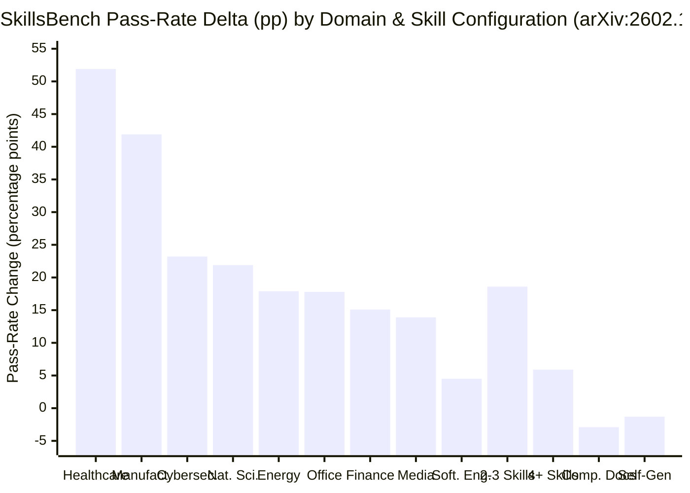
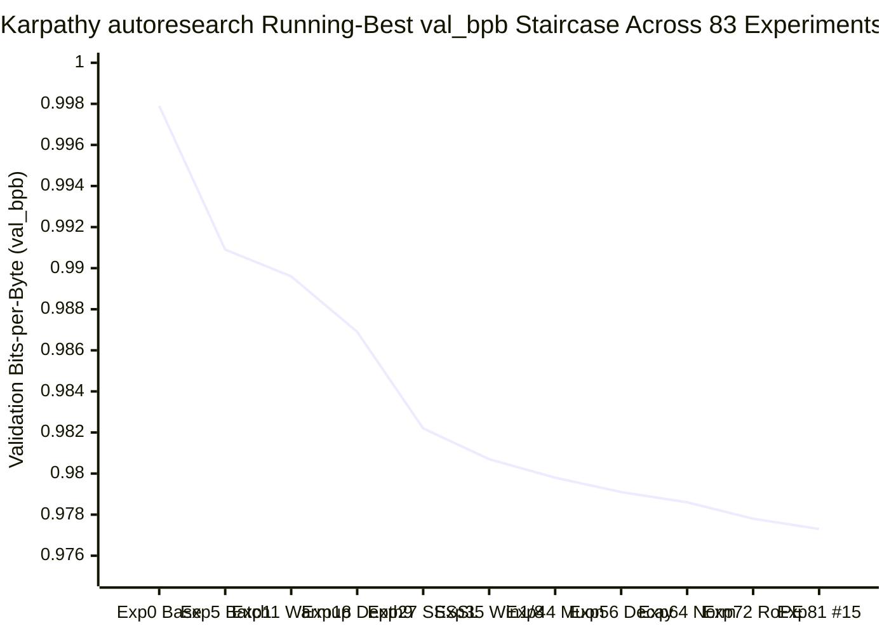
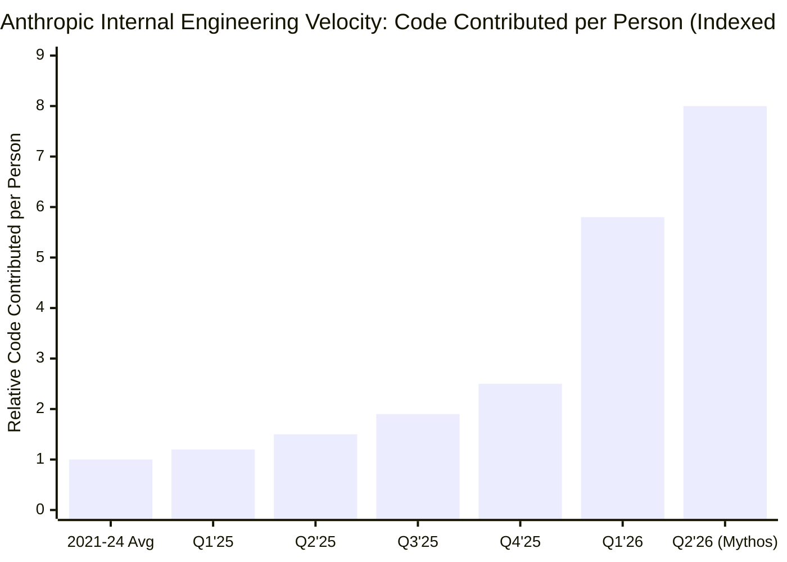
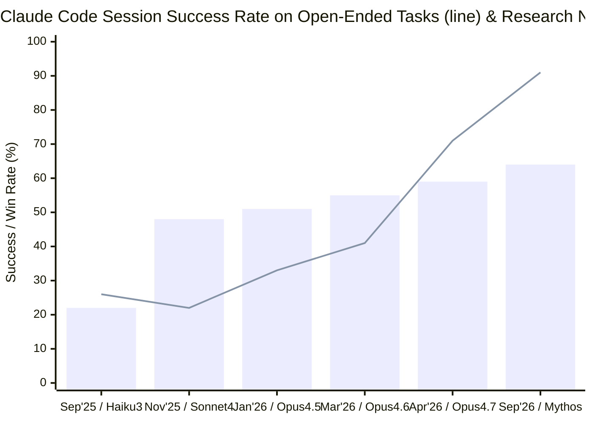

# Empirical Skill Science, Meta-MCP & Harness Engineering (`@docs/skillsbench-and-harness-guide.md`)

Referenced on demand from `CLAUDE.md`, `GEMINI.md`, and `AGENTS.md`.

## 1. SkillsBench Empirical Findings (`arXiv:2602.12670v1`, Li et al., 2026)
- Evaluated across **84 active tasks** (`86` configured), **11 domains**, and **7,308 valid agent trajectories** across 7 frontier model-harness configurations (`Claude Code`, `Gemini CLI`, `Codex CLI`):
  - **No-Skills Baseline vs. Curated Skills**: Curated Skills boost average pass rate by **+16.2pp** (e.g., `Claude Opus 4.5`: `22.0% -> 45.3%` [**+23.3pp**]; `Gemini 3 Flash`: `31.3% -> 48.7%` [**+17.4pp**]; `Claude Haiku 4.5 + Skills` [`27.7%`] outperforms `Claude Opus 4.5` without skills [`22.0%`]).
  - **Self-Generated Skills Degrade Accuracy (`-1.3pp` avg, `-5.6pp` on `Codex + GPT-5.2`)**: Prompting an agent to generate its own procedural skills on the fly before solving a task degrades accuracy because models emit vague, high-level truisms or hallucinated API flags.
  - **Domain Heterogeneity (`+51.9pp` to `+4.5pp`, `16/84` tasks negative)**: Specialized procedural domains (`Healthcare +51.9pp`, `Manufacturing +41.9pp`, `Cybersecurity +23.2pp`, `Natural Sciences +21.9pp`) gain far more than general `Software Engineering (+4.5pp)` already well-represented in pretraining; `16/84` tasks show negative deltas when skills introduce conflicting instructions.
  - **Skill Count (`2–3` Modular Skills Peak at `+18.6pp`) & Complexity (`Detailed +18.8pp` vs. `Comprehensive -2.9pp`)**: `2–3` focused skills (`+18.6pp`) outperform `1` skill (`+17.8pp`), while `4+` skills drop to `+5.9pp` (`-12.7pp` overload penalty). `Detailed` (`+18.8pp`) and `Compact` (`+17.1pp`) manuals work best, while `Comprehensive` encyclopedic dumps hurt (`-2.9pp`).
  - **Failure Taxonomy Reduction & Cost Pareto**: Curated skills cut `Quality Below Threshold` failures by **-30.8%** (`1,184 -> 819`) and `Incomplete Solution` failures by **-35.8%** (`243 -> 156`); `Gemini 3 Flash + Skills` (`48.7%` at `$0.57/trial`) matches `Gemini 3 Pro + Skills` (`48.5%` at `$1.06/trial`) at **47% lower cost**.

### Chart 1 — SkillsBench Pass-Rate Gain by Domain (`11` Domains, `N = 84` Tasks) & Skill Configuration

## 2. Curated API Grounding (`andrewyng/context-hub`) & Meta-MCP "Code Mode" (Stanford CS146S)
- **`@aisuite/chub` (`context-hub`)**: Prevents SDK hallucinations by fetching versioned, language-specific docs (`chub search`, `chub get --lang py`) and persisting session discoveries via `chub annotate` (`--with-annotations`).
- **Meta-MCP "Code Mode" (`search` + `execute`)**: Replaces 100+ raw CRUD tool schemas with 2 compact meta-tools (`mcp__meta__search` and `mcp__meta__execute`), reducing standing schema token overhead by **$\ge 90\%$**.

## 3. Multi-Agent VCS (`git worktree` vs. Jujutsu `jj`), Durable Execution (`Temporal`), Meta-Harnesses (`Databricks Omnigent`), Ratchets (`karpathy/autoresearch`) & Recursive Self-Improvement (`Anthropic Institute`)
- **Multi-Agent Workspace Isolation & Stacked Change Management (`git worktree` vs. Jujutsu `jj`, `wavect.io` & `jj-vcs/jj`)**:
  - **Provisioning Cost vs. Integration Cost (`wavect.io`, Riedl 2026)**: $\text{Provisioning Cost} = \text{Task Starts} \times \text{Cold-Start Min} \times \text{Runner Cost/Min}$ (reduced via `git worktree` + shared `.git` object store / `--filter=blob:none` partial clone) vs. $\text{Integration Cost} = \text{Accepted Changes} \times \text{Reviewer \& Merge Min} \times \text{Eng Cost/Min}$ (reduced via colocated **Jujutsu `jj git init --colocate`** & `jj workspace add`).
  - **Why Colocated Jujutsu (`jj`) Excels for Agentic Loops**: (1) **Working Copy Is a Commit (`@`)** — zero-ceremony auto-snapshotting on every command without `git add`/`stash`; (2) **Stable Change IDs (`k–z`) vs. Commit IDs (`0–9a–f`)** across rewrites; (3) **First-Class Conflict Algebra** ($\Delta M = \text{Tree}(M) - \text{AutoMerge}(P_1, P_2)$) — rebases never abort mid-loop on conflicts, descendants auto-rebase immediately, and N-parent integration commits (`jj new changeA changeB`) rebase cleanly; (4) **Transactional Operation Log (`jj op log`, `jj undo`, `jj op restore <OP_ID>`)** + non-interactive `jj split -m`, `jj squash --into <REV> -u`, `jj absorb`, and `jj converge --no-interactive`. (Use pure `git worktree` when repositories require Git LFS, submodules, `.gitattributes`, or `--filter=blob:none` partial clones.)
- **Durable Execution Frameworks (`Temporal`, `LangGraph`, `DBOS`, `Restate`, `Inngest`)**: Wrap deterministic agent orchestration inside replayable **Workflows** while executing non-deterministic LLM and MCP tool calls as fault-tolerant **Activities** with event-history replay and zero-compute Human-in-the-Loop (HITL) signals.
- **The 4-Stage Meta-Harness Layer (`Databricks Omnigent`, `omnigent.ai`, Zaharia et al., Jun 2026)**: Sits *above* individual coding harnesses (`1. Heterogeneous Agents [Claude Code, Codex, OpenCode, agy, Pi + Custom YAML/SDKs]` $\to$ `2. Omnigent Runner [Sandboxing, Reliability, Egress Proxy]` $\to$ `3. Omnigent Server [History, Catalog, Policies, MCPs, Artifacts, Skills + PostgreSQL / Docker / MLflow + GEPA/MemEx/RLM]` $\to$ `4. Five Surfaces [Terminal UI, Web UI with inline diff comments, Native App, Mobile UI, REST API]`) to **Combine**, **Control** (stateful session-history security policies — e.g., escalating `git push` to require human approval after `npm install`, pausing every \$100 of LLM spend, and **Egress-Proxy Credential Injection** so the agent runtime never sees raw GitHub/cloud tokens), and **Share** (live multiplayer session URLs).
- **3-File `autoresearch` Separation (`karpathy/autoresearch`)**: Immutable evaluator (`prepare.py`), single mutable target (`train.py`), and human-authored harness spec (`program.md`) with the **Simplicity Criterion** and Git Keep-or-Revert Ratchet (`83` overnight experiments, `15` kept improvements, `68` reverted regressions, stepping `val_bpb` down from `0.9979 -> 0.9773`).
- **Why "Lights-Off" Factories Fail (`Ib5GBkD555M`)**: RLVR optimizes $t=0$ test pass rather than $t=6\text{ mo}$ maintainability; prevent architectural collapse via **Front-Loaded Program Design** (explicit types, interfaces, and call-trees before vertical slices).

### Chart 2 — Karpathy's `autoresearch` Step-Down Ratchet (`83` Experiments, `15` Kept Improvements: `0.9979 -> 0.9773 val_bpb`)

### Chart 3 — Anthropic Institute Recursive Self-Improvement (`Q2 '21 – Q3 '26`): Code Contributed per Person (`1.0x -> 8.0x`) & Open-Ended Session Success (`26% -> 91%`)

*Note:* In Anthropic's *Recursive Self-Improvement* empirical study (`anthropic.com/institute/recursive-self-improvement`), internal code contributed per person surged to **`5.8x` in Q1 '26** and **`8.0x` in Q2 '26** (`>80%` AI-written), open-ended `Claude Code` session success climbed from **`26%` (Sep '25, dipping to `11%` Oct '25)** to **`71%` (Apr '26 Mythos)** and **`91%` (Sep '26)** (converging with Trivial `89%`, Routine `92%`, and Substantial `92%`), and on $n=129$ suboptimal researcher experimental steps, `Mythos Preview` proposed a **better next step `64%` of the time (`73%` including ties)** vs. the `50%` human baseline and `52x` overnight CPU kernel speedup (`4x` human baseline).

